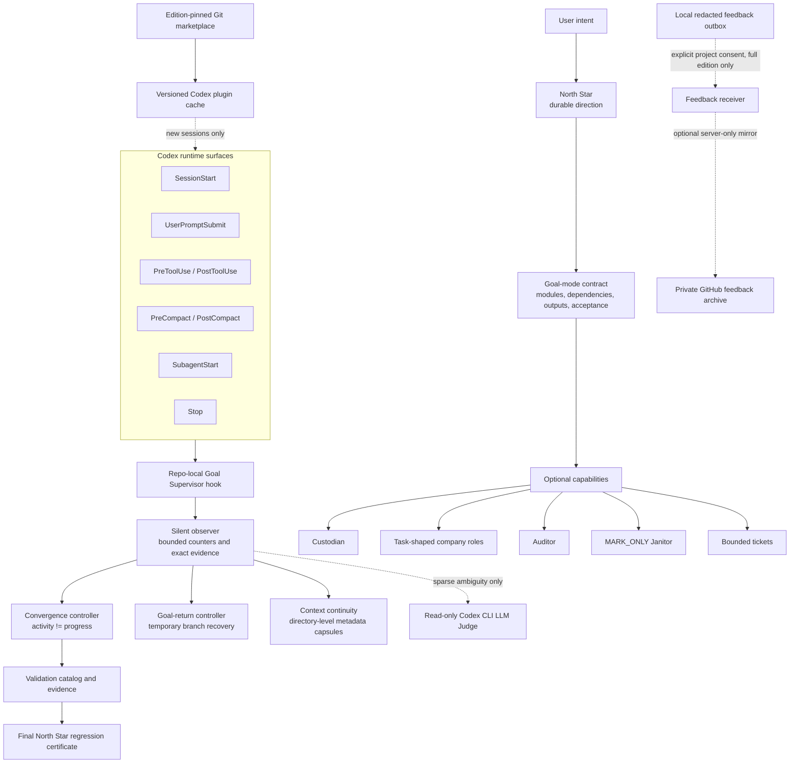

# Codex Goal Supervisor

Codex Goal Supervisor is an execution-convergence tool for long-running Codex work. It helps an Agent preserve the user's real objective, distinguish activity from progress, recover after interruptions, and finish with evidence without turning supervision into the work itself.

## Why We Built This

Coding Agents are entering the **Loop Era**. A useful task is no longer one prompt followed by one answer: an Agent may inspect a large codebase, delegate research, change dozens of files, run tools for hours, survive context compaction, react to temporary user requests, and continue across many iterations.

That creates a new bottleneck. The limiting factor is no longer only whether a model can produce a good next action. It is whether thousands of individually plausible actions continue to converge on the same valuable outcome.

Long-running work exposes failure modes that short benchmarks rarely measure:

- **A large objective never becomes an executable definition.** The Agent receives an ambitious outcome but no stable decomposition into stages, dependencies, concrete outputs, contribution to the goal, and product-level acceptance, so locally reasonable work has no reliable finish line.
- **Business feasibility is postponed behind infrastructure.** The Agent can spend hours refining architecture, security, permissions, abstractions, or future extensibility before proving the smallest real user-facing loop works at all.
- **The solution is built before the available path is understood.** Existing tools, prior implementations, and reusable project assets are discovered too late, after a custom framework has already created avoidable cost and lock-in.
- **A plausible local direction becomes a treadmill.** Each new layer, refactor, framework, or hardening step looks related to the project, yet the current milestone and its acceptance evidence remain unchanged.
- **A temporary request captures the run.** After context compaction or interruption, the most recent side request can become the new center of gravity even after that branch is already complete.
- **Activity is mistaken for progress.** Files, commands, tokens, retries, and subagents accumulate while the number of satisfied success criteria does not.
- **Failure does not become knowledge.** The Agent repeats an invalidated approach, reruns downstream checks after an upstream failure, or changes direction without preserving what the previous result already proved.
- **Structural validity is mistaken for product validity.** A file exists, a build passes, or an artifact opens, but the actual workflow, visual quality, business behavior, or end-to-end user outcome has not been demonstrated.
- **Exploration loses its return path.** Useful investigation expands into an unbounded branch instead of producing a decision, a reusable finding, or a return to the active milestone.
- **Parallel work increases motion but not throughput.** Specialists duplicate reading, diverge on interfaces, or produce ceremonial handoffs when ownership, dependencies, and output contracts are unclear.
- **Long reads consume the working context before conclusions are sealed.** Compaction then causes rereading, forgotten constraints, or decisions based mainly on the newest visible fragment.
- **The execution model ignores the real project shape.** Runtime state, generated data, binary assets, CAD/BOM dependencies, batch outputs, and long external jobs cannot be judged as if every project were a small static source repository.
- **The Agent keeps optimizing after the result is sufficient.** Completion becomes more files, more polish, or more architecture rather than a verified product result and a deliberate stop.
- **Control itself can become the bottleneck.** Tickets, roles, audits, and repeated checks only help when the rework they prevent is greater than the delay, context, and coordination cost they introduce.

These are **convergence failures**. They are not solved by a stronger next-token decision alone, because they emerge across time, state transitions, interruptions, accumulated local choices, and changing evidence.

The project therefore starts from three principles:

1. **Prove the business loop first.** Establish the smallest real, runnable, end-to-end capability before broad architecture, comprehensive security, or generalized infrastructure. Apply only the minimum boundary needed to keep that proof authorized, contained, and reversible.
2. **Turn intent into an evidence path.** Define the modules, dependencies, outputs, reuse choices, and acceptance that connect the current action to the final result.
3. **Measure progress by evidence.** A task advances when a success criterion changes from unknown or failing to verified, not when the Agent produces more activity.
4. **Spend control only where it creates net value.** Ordinary reversible work stays light. Stronger intervention is reserved for expensive repetition, unsupported completion claims, persistent deviation, and irreversible boundaries.

## Mission

> Let an Agent work longer without becoming less aligned, move faster without hiding unfinished work, and recover from deviation without throwing away useful progress.

Codex Goal Supervisor is designed as a **rational, low-noise administrator**, not a project decision maker. The execution Agent and the user retain judgment. The Supervisor preserves intent, observes evidence, detects expensive failure patterns, and applies the smallest useful intervention.

Its long-term ambition is to make autonomous Agents dependable enough to carry meaningful projects from intent to verified delivery: persistent enough to finish, self-correcting enough to recover, and quiet enough that coordination never becomes the product.

Its supreme rule is:

> Every action taken by the model and every supervisory intervention by this plugin must produce net execution benefit. Any action that may affect other modules without constraint or become noise for the entire project must be managed. If the cost of a control by this plugin exceeds the rework it can prevent, that control must remain inactive.

## What It Solves

| Long-run failure | Codex Goal Supervisor response | Intended result |
| --- | --- | --- |
| The project gradually forgets why it exists | Preserve a concise, project-owned North Star | Durable direction across long execution |
| A large objective is too vague to execute | Maintain a separate detailed Goal-mode contract with modules, dependencies, outputs, and acceptance | Concrete work without confusing the North Star with the plan |
| The Agent builds before checking what can be reused | Probe existing tools and project history at plan inception or a material route change, then record an explicit reuse or rejection decision | Less reinvention without forcing research on every turn |
| A temporary user request captures the loop | Track it as a bounded branch and restore the active Goal after completion or compaction | Temporary work ends instead of replaying for hours |
| Activity is mistaken for progress | Track evidence-backed success criteria and convergence state separately from command/file counts | Progress means closer to acceptance, not merely busier |
| The same failure or wrong direction continues | Keep persistent incidents, recheck continued affected-path work, and use a sparse read-only LLM Judge only at high-value ambiguity | Escalation is evidence-based and targeted |
| Large reads consume context before producing conclusions | Keep bounded directory-level metadata capsules and encourage staged conclusions or read-only subagents when the material is truly separable | Context survives without copying source text into the plugin |
| High-cost work is changed without proof | Offer machine acceptance, validation catalogs, checkpoints, and optional bounded tickets | Expensive iterations become testable and recoverable |
| Specialist coordination becomes ceremony | Select zero to four task-shaped company roles by default; larger rosters require an explicit main-thread expansion decision | Independent perspectives only when they reduce expected rework |
| Cleanup deletes legitimate project assets | Janitor is MARK_ONLY and distinguishes protected evidence from review candidates | Cleanup remains reversible and reviewable |
| The Agent declares the whole project complete too early | Require a current project-level final-regression certificate for the North Star completion claim | Delivery is tied to end-to-end evidence |

## System Map



The implementation adapts eight Codex hook lifecycle events, the Codex plugin skill surface, a timeout-bounded Codex CLI judgment path, versioned marketplace installation, and native macOS/Windows/Linux update schedulers. See [Codex integration architecture](docs/ARCHITECTURE.md) for the exact mapping and failure boundaries.

## Product Boundary

Codex Goal Supervisor deliberately does **not** become the project itself:

- It does not auto-enroll unrelated repositories. Project use is explicit opt-in.
- It does not silently rewrite a confirmed North Star or replace user judgment.
- It does not require a ticket, role receipt, or audit pass for ordinary work.
- It does not delete or move product files; Janitor only marks candidates.
- It does not upload diagnostics by default. The offline and update-only editions physically omit upload code.
- It does not treat semantic uncertainty as permission to block. Missing or malformed LLM judgment fails open.
- It is not a security sandbox, approval board, signature ledger, Agent OS, or corporate governance simulator.
- Hard stops are reserved for deterministic irreversible boundaries, exact project-authored forbidden paths, and a repeatedly confirmed wrong-direction surface. Aligned work, reads, tests, validation, and repair remain available.

## Choose An Edition

| Edition | Choose it when | Automatic updates | Remote diagnostic delivery |
| --- | --- | --- | --- |
| `offline` | The device or project must contain no network update or feedback transport code | Physically absent | Physically absent |
| `update-only` | You want automatic plugin updates but no remote feedback capability in the package | Included, edition-pinned | Physically absent |
| `full` | You want updates and the option to explicitly contribute redacted plugin diagnostics | Included, edition-pinned | Included but off by default and project-consent gated |

Download the three hash-verifiable artifacts from the [latest release](https://github.com/yimengbenxin/codex-goal-supervisor/releases/latest). Installing the plugin does not activate it inside every project; project installation remains explicit.

[Licensed under Apache-2.0](LICENSE). Contributions and reproducible bug reports
are welcome; see [CONTRIBUTING.md](CONTRIBUTING.md) and [SECURITY.md](SECURITY.md).
Source, issues, and releases are published at
[github.com/yimengbenxin/codex-goal-supervisor](https://github.com/yimengbenxin/codex-goal-supervisor).

Its capabilities are goal-mode problem-solving skills: they teach the execution
agent how to recover, validate, delegate, or clean up, but do not take over the
product task or its final judgment.

## Current Operating Model

Codex Goal Supervisor has one public plugin identity. Release numbers describe internal compatibility only; upgrades replace older installed runtime files in place while preserving project-owned state.

The plugin has two layers:

- **Implicit background observer:** after explicit project installation, a repo-local hook quietly records small counters and concrete signals. It normally says nothing. It does not require tickets, role receipts, status checks, or cleanup passes.
- **Explicit capability layer:** explicit activation first requires one structured project North Star and the matching Codex Goal mode. Custodian, Company roles, Auditor, Janitor, MDCP, convergence records, and bounded tickets remain on demand.

North Star setup is not part of the silent observer. When the user explicitly activates Codex Goal Supervisor for a substantive task, the AI must establish or reuse the concise project-owned North Star and start Codex Goal mode with its separate executable contract. The Goal-mode contract is 2,000-3,500 characters. Super-complex work also references a project plan longer than 4,000 characters while keeping the compressed contract in Goal mode. Unrelated tasks are never auto-enrolled.

## Intervention Policy

| Situation | Supervisor behavior |
| --- | --- |
| Ordinary edit/read/validation | Silent |
| Ambiguous scope, repeated tool failures, budget pressure, broad write surface | One compact strong warning |
| Exact project-authored North Star deviation, first or second confirmation | Strong warning; same incident remains open |
| Same exact deviation confirmed a third time | Sparse read-only LLM Judge reviews the pending rail; only a high-confidence confirmation blocks that wrong-direction surface |
| Destructive `git reset`/`git clean` | Block |
| Direct control-state edit | Block |
| Exact active-ticket forbidden or immutable path | Block |
| Hook/runtime failure | Fail open; report once |

Warnings do not require a ticket and do not stop execution. Generic semantic guesses never become hidden denials. The LLM Judge is invoked only for a pending targeted rail, an explicit high-cost ambiguous action, an appeal with new evidence, or two completed iterations without evidence progress. Results are structured and cached; missing, malformed, or timed-out judgment fails open.

## Optional Capabilities

- **North Star:** durable project direction; never silently rewritten. Alignment against this layer answers whether the work is still heading toward the right product outcome.
- **Goal-mode contract:** concrete modules, actions, serial/parallel relationships, dependencies, outputs, contribution to the goal, and acceptance. Alignment against this layer answers which concrete module, output, or acceptance condition the work advances. It is not the North Star sentence.
- **Super-complex plan:** project-relative Markdown/README over 4,000 characters, referenced by a real 2,000-3,500 character Goal-mode contract. The Agent researches existing tools and articles first; if reuse is viable, it visibly asks the user whether to reuse it and whether the project is commercial before finalizing the route.

The convergence controller uses both layers. Explicit North Star anti-goals and explicit Goal-contract non-goals are tracked separately. A write that does not have an obvious positive module match is not automatically wrong or blocked; it may be a prerequisite or bounded exploration, and only becomes a low-noise calibration question when a sparse Judge is otherwise warranted.
- **Custodian:** optional `request --text ...` analysis for meaningful goal/scope changes.
- **Company roles:** optional independent specialist work. Zero roles is valid; missing optional receipts do not block delivery.
- **Specialist role library:** an optional pinned Agency Agents catalog lets the main thread search and read complete expert prompts without making those profiles decision authorities or copying them into the user project.
- **Expert-assisted Goal authoring:** an explicit `goal-brief` call may select one high-confidence industry expert to provide structured domain input. The main thread remains the sole Goal author; weak matches produce no expert injection.
- **Auditor:** optional `check`; `close` remains strict only about truthful machine certification.
- **Janitor:** optional MARK_ONLY artifact review. It cannot move or delete product files.
- **Bounded tickets:** optional contracts when isolation, machine acceptance, or parallel ownership creates net benefit.
- **Convergence:** optional `convergence` status and iteration records separate activity from evidence-backed progress and retain the latest recovery checkpoint.
- **Collaboration liveness:** cross-thread praise and agreement never count as progress. Two evidence-free handoffs produce `CONSENSUS_WITHOUT_PROGRESS` and end mutual review in favor of execution, validation, or one concrete escalation.

Normal product work is valid without an ACTIVE ticket.

## Verification Before Completion

Every completed implementation action needs verification proportional to its risk. A focused local check is sufficient for a small change; the full suite is not repeated after every edit. The final North Star claim is stricter: run project-level end-to-end regression with catalogued commands before delivery.

The repo-local observer now keeps a bounded verification debt: a product write opens the debt, and only an observed successful validation started after that write clears it. It stays silent during normal work. At `Stop`, it adds one strong reminder only when the assistant explicitly claims completion while the debt is still open. If the runtime supplies no `PostToolUse` result, the observer reports the result as unobserved instead of assuming success. `.agent/**` and `.codex/**` state never create product verification debt. A claim that the entire confirmed North Star is complete still requires a current `CERTIFIED_COMPLETE` final-regression certificate.

```bash
python3 .agent/goal_compass.py convergence \
  --certify-goal \
  --final-validation-id project_regression
```

Until that command passes, the truthful state is implementation finished but `NEEDS_FINAL_REGRESSION`. A failed regression remains `FINAL_REGRESSION_FAILED`; only `CERTIFIED_COMPLETE` means the North Star may be reported complete. The certificate becomes stale if the confirmed North Star is replaced.

## Goal Return After Temporary Requests

When a confirmed project Goal exists, a new user message is treated as a bounded branch unless it explicitly replaces the Goal or establishes a persistent constraint. The repo-local hook records only a short redacted summary, affected paths, lifecycle state, and the stored Goal checkpoint. `Stop` closes a completed branch; `PreCompact`/`PostCompact` seal the state; `SessionStart(source=compact)` restores the current Goal and marks closed branches as inactive. A plain `continue` resumes the Goal without creating another branch.

This is not another visible workflow. The first evidence-backed attempt to resume a closed branch is silent model context, the second is a warning, and only a third exact-path replay may ask the sparse LLM Judge whether a targeted rail is justified. Missing or uncertain judgment remains non-blocking. State and events are project-local, redacted, and bounded; `status --verbose` exposes only a compact summary.

## Install

```bash
python3 scripts/install_governor.py /path/to/repo --force
```

Installation writes only `.agent/**` and `.codex/hooks.json`. It does not overwrite the project README, AGENTS, or tests. This edition stores redacted diagnostics locally and contains no feedback upload transport.

## Distribution Editions

The project publishes three physically distinct ZIPs from the same tested
source release:

| Edition | Automatic updates | Remote feedback delivery |
| --- | --- | --- |
| `offline` | Code absent | Code absent |
| `update-only` | Included, edition-pinned | Code absent |
| `full` | Included, edition-pinned | Included; disabled until explicit project consent |

The first two packages replace the feedback runtime with a local-only recorder
and remove receiver, registration, credential, endpoint, and upload-command
code. The offline package additionally removes updater and scheduler code. An
online updater refuses to install a package whose `distributionEdition` differs
from its configured channel.

The online editions use separate Git marketplaces so an `update-only` install
cannot silently become the `full` network-capable edition:

- `full`: [codex-goal-supervisor-marketplace](https://github.com/yimengbenxin/codex-goal-supervisor-marketplace)
- `update-only`: [codex-goal-supervisor-update-only-marketplace](https://github.com/yimengbenxin/codex-goal-supervisor-update-only-marketplace)

Build all three packages:

```bash
python3 scripts/build_plugin_release.py --all-editions-dir dist
```

## Plugin Auto Update

Auto-update is device-scoped, not project-scoped. Run the one-time setup from an
extracted plugin package:

```bash
python3 scripts/configure_plugin_auto_update.py
```

It registers the Codex Git marketplace source, installs the canonical
`codex-goal-supervisor@goal-supervisor` plugin, removes an older duplicate
installation from another marketplace, and creates a low-priority daily check:

- macOS: user `LaunchAgent`;
- Windows: user Task Scheduler entry;
- Linux: user `systemd` timer.

The updater calls only native Codex commands: `plugin marketplace upgrade`,
`plugin list`, and `plugin add`. It uses a process lock, hard timeouts, HTTPS-only
marketplace configuration, downgrade protection, and versioned Codex cache
verification. It never writes a user repository and never replaces code inside
an active session. When a new version is installed, start a new Codex session
when convenient; existing work continues on its loaded version.

Read status or force a check without entering a project:

```bash
python3 ~/.codex/goal-supervisor-updater/plugin_auto_update.py --status
python3 ~/.codex/goal-supervisor-updater/plugin_auto_update.py --force
```

Disable scheduling while keeping the installed plugin:

```bash
python3 scripts/configure_plugin_auto_update.py --disable
```

The update host is configurable. Re-run setup with
`--marketplace-url https://new-host/path.git` to migrate devices to a replacement
server. No feedback-upload consent or project data is involved in plugin update
checks.

## Optional Ticket Flow

```bash
python3 .agent/goal_compass.py compile rough_task.md --out .agent/tickets/pending/TICKET.json
python3 .agent/goal_compass.py ready .agent/tickets/pending/TICKET.json
python3 .agent/goal_compass.py start .agent/tickets/pending/TICKET.json
python3 .agent/goal_compass.py check --run-validation
python3 .agent/goal_compass.py close
```

`compile` produces a DRAFT. Empty machine acceptance cannot start or PASS. Budget pressure and ordinary scope expansion are advisories. Explicit forbidden/immutable boundaries remain hard. A failed `close` returns `NOT_CERTIFIED` and leaves the ACTIVE ticket available for repair.

## Background Signals

The observer stores compact state in `.agent/runtime/observer_state.json`. It tracks counts and at most 100 candidate paths, not source contents. Lock-contended events use a bounded fallback queue and are folded into the next successful observation; the diagnostic event projection retains only the latest 128 events (up to 64 KiB). Current thresholds are intentionally sparse:

For read-heavy turns, Codex Goal Supervisor also keeps a bounded metadata-only context ledger. A
small read stays silent. Large historical-code or document reads are indexed in
`.agent/runtime/context/index.json`, with file fingerprints split under
`by-directory/<project-path>/_context.json`. Nothing is proactively injected
into the main thread and no source text is copied into supervisor state. The
execution agent may use `status --verbose`, load only the relevant directory,
and record an explicit per-directory conclusion with `context-note`. For a
genuinely large read, the main thread reports conclusions after each meaningful
slice instead of waiting until the end. If the remaining archive has independent
directory or evidence slices, it may autonomously use read-only subagents and
merge their structured findings. Hooks never open agents or inject capsules.
For code-heavy work, an already-configured Serena reader may be used for
symbol/reference retrieval; an already-installed FastCtx reader may be used for
paged output. Neither is installed or enabled by Goal Supervisor. Without them,
the same policy uses normal tools with bounded line ranges. The ledger records
which reader kind was observed, distinguishes model-facing output from source
file size, recommends subagents only for independently partitionable slices,
and marks directory conclusions stale when their evidence changes.

- three consecutive failed tool calls;
- 50 observed write paths, prompting confirmation that the work is an intentional batch or declared artifact set.

These are warnings, not automatic cleanup or proof of drift.

Exact North Star deviation incidents use a separate persistent counter. The same incident is rechecked after 30 minutes of continued affected-path work (or earlier when continuation is materially broad). Unrelated success never clears it. At strike two, the plugin obtains or reuses a sparse semantic judgment. At strike three, only a high-confidence `CONFIRM_TARGETED_RAIL` blocks the wrong-direction surface; unavailable or uncertain judgment remains a strong warning. Reads, tests, validation, correction, and unrelated aligned paths remain available. The AI can open a scoped repair with `deviation-correct`, then mark evidence with `deviation-corrected`. Counts clear only after explicit correction survives seven days with real project activity and no recurrence.

## Low-Noise Commands

- `status` returns current truth, one reason, one next action, compact observer state, and the active ticket summary. Use `status --verbose` for company, MDCP, feedback, reuse, hook, and checkpoint details.
- `convergence` returns the L0-L3 goal stack, evidence progress, activity counters, iteration state, and recovery checkpoint. `convergence --record-iteration ...` records a high-cost experiment; `convergence --judge ...` explicitly asks the sparse Judge.
- `onboard-scan` still writes the full JSON/Markdown reports, but stdout contains only alignment, evidence counts, classification counts, and report paths. Use `onboard-scan --verbose` to print the inventory.
- An unconfirmed North Star is `NEEDS_CONFIRMATION`, not a command failure. Destructive cleanup remains unavailable until confirmation.

## Privacy

Diagnostic feedback remains project-local. This edition contains no network transport, device registration, remote endpoint, credential handling, or upload command.

## Verification

```bash
python3 -m py_compile assets/governor-harness/.agent/goal_compass.py scripts/install_governor.py scripts/goal_hook.py verification/tests/*.py
python3 -m unittest -q verification.tests.test_goal_compass
python3 -m unittest discover -s verification/tests -v
python3 assets/governor-harness/.agent/selftest/test_goal_compass.py
```

Codex Goal Supervisor is not a security sandbox, approval board, signature/HMAC ledger, reverse-signal workflow, or company governance simulator.

## Open Source

The public repository contains the plugin source, tests, documentation, and the
attributed third-party role snapshot. This package contains no feedback receiver.
Project runtime state, machine configuration, feedback exports, and credentials
are intentionally excluded.
