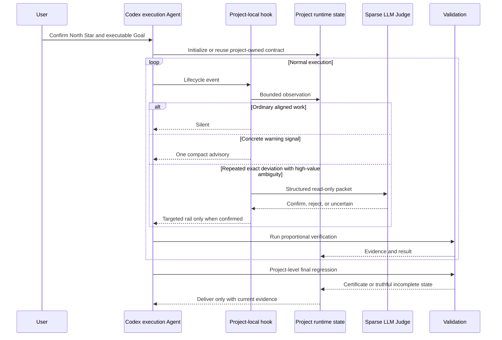

# Codex Goal Supervisor Architecture

## Design Objective

Codex Goal Supervisor is built for a specific transition: coding Agents are moving from short responses to long-running execution loops. The architecture therefore optimizes for sustained convergence, not maximum intervention.

The system keeps four concerns separate:

1. **Intent:** what durable outcome the user wants.
2. **Execution:** what the current stage and action should produce.
3. **Evidence:** whether the action created verified progress.
4. **Administration:** when a warning or targeted boundary has higher expected value than its process cost.

The user and the execution Agent remain the decision makers. Goal Supervisor is the project-scoped administrative layer.

Every action taken by the model and every supervisory intervention by this plugin must produce net execution benefit. Any action that may affect other modules without constraint or become noise for the entire project must be managed. If the cost of a control by this plugin exceeds the rework it can prevent, that control must remain inactive.

## Problem Model

The architecture is designed around failure patterns that emerge only during sustained execution. They are product and execution problems, not merely prompt-quality problems.

| Convergence problem | Architectural response |
| --- | --- |
| A system-level objective has no executable stages, dependencies, outputs, or finish line | Separate the durable North Star from a detailed Goal contract and connect L0-L3 intent to the current action |
| Architecture, security, governance, or extensibility grows before the smallest business loop is proven | Keep the North Star tied to the user outcome, make the current Goal contract concrete, and treat broad infrastructure as optional until the end-to-end path has evidence |
| Custom infrastructure is built before existing tools and project assets are evaluated | Run bounded reuse discovery at plan inception or material route changes, then make adoption or evidence-backed rejection explicit |
| Many actions occur but no success criterion changes | Keep activity counters separate from evidence-backed convergence state |
| A temporary prompt becomes the durable objective after compaction | Track bounded branches, seal a return target before compaction, and tombstone completed temporary work |
| A failed approach is repeated or downstream validation continues after an upstream blocker | Preserve failure conclusions and dependency-aware evidence so the next action can repair, retry, or skip blocked work |
| Locally relevant work no longer advances the current milestone | Align against both the durable North Star and the concrete Goal module, output, and acceptance currently in force |
| Files or technical checks pass while the product remains unusable | Separate implementation evidence from project-level end-to-end certification |
| Large reads consume context before a conclusion is emitted | Use bounded metadata capsules, staged conclusions, and optional read-only subagents for genuinely separable material |
| Parallel specialists create duplicate work or incompatible outputs | Use task-shaped roles only when ownership, dependencies, and output contracts make parallelism cheaper than serial work |
| Runtime files, generated assets, binary deliverables, or long jobs look like source drift | Keep project-owned tracking contracts and runtime/generated boundaries instead of assuming every artifact is source text |
| The control process costs more than the expected rework | Keep the background observer silent, make advanced capabilities optional, and escalate only on concrete high-value signals |

The ordering is deliberate: **real business capability first, the minimum effective boundary second, broader technical and security strengthening after the business loop is verified**. Safety and engineering controls must preserve the path to a runnable result rather than replace it.

## Codex Adaptation Map

| Codex surface | Goal Supervisor adaptation | Purpose | Boundary |
| --- | --- | --- | --- |
| Plugin manifest and skill | `.codex-plugin/plugin.json` and `skills/goal-supervisor/SKILL.md` expose one canonical plugin identity and usage contract | Give Codex explicit access to the capability set | Does not auto-activate a repository |
| Project-local hooks | The installer generates `.codex/hooks.json` for the selected project | Observe real lifecycle events with project-local state | Plugin-level `hooks/hooks.json` stays empty so unrelated projects remain untouched |
| `SessionStart` | Restore the active North Star checkpoint, open branch state, and bounded context pointers | Continue correctly after a new or compacted session | Restores structured state, not hidden reasoning |
| `UserPromptSubmit` | Classify a new prompt as continue, bounded temporary branch, persistent constraint, or explicit Goal replacement | Prevent a temporary request from silently replacing the project | A confirmed North Star is never rewritten without explicit intent |
| `PreToolUse` | Inspect deterministic command and path boundaries before a write | Stop irreversible Git cleanup, direct control-state edits, and exact forbidden/immutable writes | Semantic uncertainty is advisory and fails open |
| `PostToolUse` | Record observed success/failure, affected paths, evidence, and verification debt | Separate a command starting from a command succeeding | Missing result evidence remains unknown, not PASS |
| `PreCompact` / `PostCompact` | Seal Goal-return state and directory-level context capsules | Preserve orientation through context compression | Capsules contain bounded metadata and explicit conclusions, never copied source bodies |
| `SubagentStart` | Provide task-shaped role or read-only large-read guidance when explicitly useful | Reduce duplicate reading and clarify independent deliverables | Zero roles is valid; the main thread keeps decision authority |
| `Stop` | Close completed temporary branches and surface one completion reminder only when product-write verification debt remains | Return to the active Goal and prevent unsupported completion claims | Does not force a full suite after every small edit |
| Codex CLI | Invoke a sparse, read-only structured LLM Judge with timeout and caching | Review high-value ambiguity before a targeted rail | Not resident; malformed, unavailable, or timed-out judgment fails open |
| Codex Goal mode | Maintain a detailed execution contract separate from the one-sentence North Star | Give the long loop concrete modules, dependencies, outputs, and acceptance | Goal Supervisor is not written into the product objective |
| Codex marketplace | Publish separate full and update-only Git channels into the versioned Codex cache | Make updates reproducible without cross-edition capability drift | Updater refuses downgrade and cross-edition replacement |
| Optional private GitHub feedback archive | Mirror only server-validated sanitized events in bounded batches | Centralize maintainer triage without distributing write credentials | Clients never talk to GitHub with write authority; mirror failure retains SQLite state |
| Native device schedulers | Use LaunchAgent, Task Scheduler, or systemd user timer for a low-priority update check | Keep installed versions current without project hooks doing network work | Update checks never activate a project or alter project state |

## Runtime Flow

## Internal Capability Layers

### 1. Direction and executable intent

- The **North Star** is concise, durable, and project-owned.
- The **Goal-mode contract** is detailed and operational.
- The **L0-L3 goal stack** connects user outcome, success criteria, current stage, and current action without collapsing them into one paragraph.

### 2. Background convergence observation

- Observer state is bounded and local.
- Activity counters never become proof of progress.
- Exact deviation incidents persist across unrelated successes.
- Temporary branches have explicit lifecycle and tombstones so closed work is not replayed after compaction.

### 3. Optional execution tools

- Custodian for meaningful request or scope changes.
- Company roles for independent specialist outputs.
- Auditor for machine evidence.
- Janitor for MARK_ONLY artifact classification.
- Bounded tickets for isolation, parallel ownership, or machine certification when they create net benefit.

### 4. Distribution and diagnostics

- Offline, update-only, and full releases are physically distinct.
- Online editions are pinned to separate marketplace channels.
- Diagnostic events stay local unless the current project explicitly consents.
- The receiver accepts bounded redacted Goal Supervisor event JSON rather than arbitrary file uploads.

## State And Privacy Boundary

Project runtime state lives under `.agent/**`; Codex hook configuration lives under `.codex/hooks.json`. These generated files are excluded from product diff budgets. Installation does not replace root README, AGENTS, or tests.

Context continuity stores fingerprints, counts, paths, and explicit conclusions. It does not store hidden chain-of-thought or copy project source files into Supervisor state. Remote diagnostic delivery is unavailable in the offline and update-only editions and disabled by default in the full edition.

## Failure Philosophy

The Supervisor must not become a single point of failure for ordinary work. Hook failure, Judge timeout, malformed semantic output, missing state, and feedback-delivery failure all fail open or remain locally queued. Hard boundaries are intentionally narrow and deterministic.

This is how the architecture serves its central promise: preserve long-run alignment and delivery evidence while keeping administrative cost below the rework it prevents.
